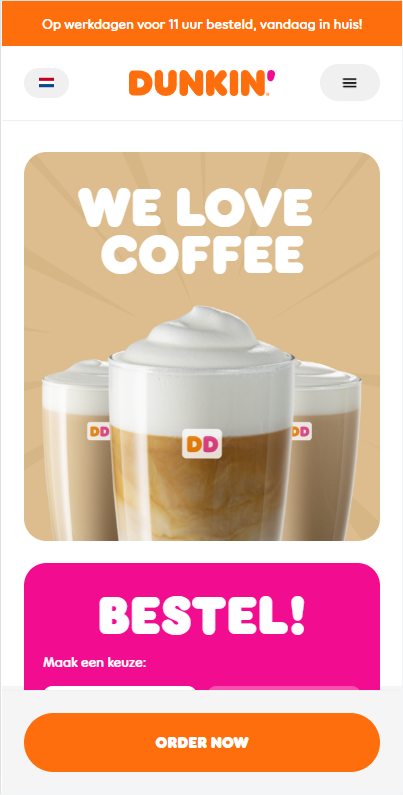
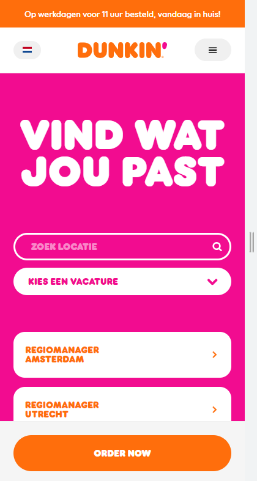

# Procesverslag
Markdown is een simpele manier om HTML te schrijven.  
Markdown cheat cheet: [Hulp bij het schrijven van Markdown](https://github.com/adam-p/markdown-here/wiki/Markdown-Cheatsheet).

Nb. De standaardstructuur en de spartaanse opmaak van de README.md zijn helemaal prima. Het gaat om de inhoud van je procesverslag. Besteedt de tijd voor pracht en praal aan je website.

Nb. Door *open* toe te voegen aan een *details* element kun je deze standaard open zetten. Fijn om dat steeds voor de relevante stuk(ken) te doen.

## Jij

  
uitwerken voor kick-off werkgroep

  ### Auteur:
  Martijn Kooijman

  #### Je startniveau:
  Rood

  #### Je focus:
  Responsiveness
 

## Je website

  
uitwerken voor kick-off werkgroep

  ### Je opdracht:
  https://www.dunkin.nl/

  #### Screenshot(s) van de eerste pagina (small screen): 
  hier de naam van de pagina  
  

  #### Screenshot(s) van de tweede pagina (small screen):
  hier de naam van de pagina  
  
 

## Toegankelijkheidstest 1/2 (week 1)

  
uitwerken na test in 1e werkgroep

  ### Bevindingen
  Lijst met je bevindingen die in de test naar voren kwamen:

  #### Screenreader
  Hier korte omschrijving (met indien nodig afbeeldingen)
  Ik ben met een screenreader door de website gegaan. Deze leest alle informatie voor. Het gebruik van een screenreader was nieuw voor mij en een uitdaging om erachter te komen hoe alles werkt. Ik heb meer inzichten gekregen in hoe een persoon met screenreader een website ervaart.
  
  In mijn website worden de elementen voorgelezen d.m.v. een screenreader. Er is rekening gehouden met de HTML structuur zodat er prioriteit wordt gegeven aan wat er als eerste wordt voorgelezen. 
    

  #### Muis en Toetsenbord 
  Ik ben door de website van Dunkin heen gegaan met d.m.v. muis en toetsenbord. Opvallend is dat als men alleen met een toetsenbord door de website heen gaat er belangrijke informatie wordt overgeslagen. In mijn versie van de website ga ik dit zeker verbeteren door alle relevante informatie toegangkelijk te maken voor gebruikers met een visuele beperking.
  
  Als je door de website heenloopt met 'Tab' of pijltjes toetsen komt de gebruiker langs alle belangrijke elementen.

  #### Motoriek (shocks, elastiekjes)
  We kregen een schokband op onze armen geplakt en hebben geprobeerd om gebruik te maken van de website. Wat mij opviel is dat simpele acties veel tijd kunnen kosten.  Daarom moeten acties zo min mogelijk moeite kosten om tot een eindresultaat te komen.
  
  Wat fijn is aan deze site is dat veel klikbare elementen groot zijn weergegeven. Mensen met bijvoorbeeld Parkinson kunnen hierdoor makkelijk acties verrichten binnen de site.
  

  
  #### Visueel (brillen, contrast, kleurenblind, dark/light).
  Elke bril had zijn eigen unieke 'belemmering'. Hierdoor kreeg ik een indruk wat mensen met beperkt zicht ervaren als ze een website bezoeken.
  Belangrijke uitgangspunten zijn:
  - Dark mode voor mensen die gevoelig zijn voor licht
  - Duidelijk contrast, vormen zijn duidelijk en men kan zien waar ze beginnen en eindigen
  - Duidelijke labels bij elementen
  
  De huidige site maakt gebruik van een duidelijk contrast en vrijwel alle vormen hebben witruimte gekregen, waardoor het duidelijk is wanneer ze beginnen en eindigen.
  Ook heeft elke sectie duidelijke labels die als inleiding van de betreffende sectie dienen.

## Breakdownschets (week 1)

  
uitwerken na afloop 2e werkgroep

  ### de hele pagina: 
  
  
  
  
  
  
  
  
  

  ### dynamisch deel (bijv menu): 
  
  
  ### wellicht nog een dynamisch deel (bijv filter): 
  

## Voortgang 1 (week 2)

  
uitwerken voor 1e voortgang

  ### Stand van zaken
  Ik vind het lastig om met CSS grid te werken. Ik heb zelf veel ervaring met flex box en ik wil zelf ook veel leren over grid. Aankomend weekend ga ik een inhaalslag maken om mijn eerste pagina volledig vorm te geven met CSS.

  ### Agenda voor meeting
  samen met je groepje opstellen

  | Martijn        | Jip          | Valena   |
  | ---            | ---                | ---          |
  | HTML Structuur presenteren | Voortgang met teamgenoten bespreken             | Ik wil bespreken over de grid van dropdown menu    |
  | Werking CSS ´order´ laten zien    | Planning van afgelopen weken | feedback van mijn team |
  | Positioning van plaatjes        | Hoe zijn jullie gestart?                | Eventuele tips          |
  | Eventuele tips van groepsgenoten        |                 |           |

  ### Verslag van meeting
  Wij hebben elkaars werk bekeken en beoordeeld. Zelf moet ik nog veel werk verrichten in de CSS. Ik heb Valena geholpen met haar CSS omdat een carousel niet helemaal werkte. Verder heb ik Jip uitgelegd hoe je het beste kunt beginnen met de start van zijn website. Ik heb verteld dat hij het beste met de HTML structuur kan beginnen en daarna vormgeven. Ook heb ik toegelicht hoe CSS flex 'order' werkt

## Voortgang 2 (week 3)

  
uitwerken voor 2e voortgang

  ### Stand van zaken
  Tot nu toe gaat het goed met mijn website. Ik moet alleen de secties nog vormgeven. Wat nog wel een belangrijk is zijn de navigatie en het daadwerkelijk responsive maken. Ik ga daar dit weekend hard mee aan de slag zodat ik volgende week kan gebruiken om veel vragen te stellen. Ik heb zelf hulp nodig met het maken van de navigatie en het verplaatsen van de content bij breakpoints.

  ### Agenda voor meeting
  samen met je groepje opstellen

  | Martijn      | Valena         | Jip    |
  | ---            | ---                | --- |
  | Social media iconen op de juiste manier stijlen  | Ik heb nog moeite met mijn filter knop dus daar zou ik ook wel meer hulp bij willen hebben | --- |
  | Hoe verstop je de H1? | Ik zou wel meer willen weten over de tabel en wat de eisen zijn voor de tweede pagina | --- |
  | --- | Voor de rest ga ik aan de slag met Javascript en het verder uitwerken van animatie. | --- |

  ### Verslag van meeting
  Tijdens de meeting heeft Valena mij meer verteld over een aria-label, heeft ze laten zien wat :after doet en ben ik teweten gekomen dat fonts in een CSS variabele mogen staan.

## Toegankelijkheidstest 2/2 (week 4)

  
uitwerken na test in 8e werkgroep

  ### Bevindingen
  Lijst met je bevindingen die in de test naar voren kwamen (geef ook aan wat er verbeterd is). 
  

  #### Screenreader
  Ik heb mijn eigen website doorlopen d.m.v. een screenreader. Wat mij opviel is dat sommige kopjes werden overgeslagen. Dit kwam omdat sommige kopjes een paragraaf waren en geen kopje.

  #### Muis en Toetsenbord 
  Ik had de volledige HTML structuur van de website al gemaakt. Deze is zeer toegankelijk voor de gebruiker en er ontbraken geen elementen.

  #### Motoriek (shocks, elastiekjes)
  Voor mensen met Parkinson is het belangrijk dat interactie met elementen makkelijk is. Een manier om dit gebruiksvriendelijk te maken is om elementen groot te maken.
  Zo heb ik het icoon om de taal te selecteren groter gemaakt. Taal is een van de belangrijkste acties op de site en moet makkelijk te bereiken zijn.
  

  #### Visueel (brillen, contrast, kleurenblind, dark/light). 
  In de les hebben we getest met verschillende brillen die visuele berperkingen simuleren. Ik heb gemerkt dat ik mijn hoofd erg moet draaien of heel dicht op mijn scherm moet zitten om tekst goed te kunnen lezen. Gelukkig bevat de website veel grote koppen en is het een makkelijk leesbaar lettertype.

## Voortgang 3 (week 4)

  
uitwerken voor 3e voortgang

  ### Stand van zaken
  Ik vond het lastig om bepaalde delen content op de juiste manier te plaatsen met grid. Uiteindelijk is mij dit gelukt. 
  
  
   
  
  Hiernaast heb ik een responsive footer en navigatie gemaakt, dit ging goed en ben ik best trots op dat dit is gelukt. 
  
  Navigatie: 
  
  
  
  Footer: 
  
  

  ### Agenda voor meeting
  samen met je groepje opstellen

  | Martijn     | Valena          |
  | ---            | ---                |
  | Op de blogs pagina wil ik dat de kolommen allemaal even grote afbeeldingen hebben  | Ik zou graag hulp willen met mijn social media iconen en hoe ik die van kleur makkelijk kan laten veranderen. Doordat dit niet standaard knoppen of links zijn begrijp ik niet helemaal hoe ik dat kan oplossen. Daarbij weet ik niet precies hoe ik een filtermenu kan toepassen en stylen binnen mijn pagina. Voor de rest gaat het aardig goed en denk ik dat ik zelfstandig aan de slag kan gaan.            |
  | Ik wil op de index pagina de koffie plaatjes naast elkaar zetten. Hier heb ik hulp nodig bij het positioneren en responsive maken |  |
  | Hoe maak je de navbar sticky? | |
  | Hoe maak ik de badge over een section | |

  ### Verslag van meeting
  Ik heb met Valena gekeken hoe we toepasselijke svg's kunnen vinden die we van kleur kunnen laten veranderen, maar helaas hebben we het probleem niet kunnen verhelpen.

## Eindgesprek (week 5)

  
uitwerken voor eindgesprek

  ### Je uitkomst - karakteristiek screenshots:
  
  Beelden van mijn eindresultaat: 
   
   
   
   

  ### Dit ging goed/Heb ik geleerd: 
  Ik heb geleerd om te werken met CSS grid. Dit is compleet nieuw voor mij en vind het leuk dat ik iets nieuws heb geleerd.
   
  

  Hiernaast heb ik nooit eerder een hamburger menu gemaakt die schaalt naar een 'normaal' menu.
  
   
  Mobiel menu 
  
   
  Normaal menu 
  
  Ook heb ik geleerd hoe je d.m.v. 'css order' elementen kan verplaatsen en hoe je elementen onzichtbaar maakt d.m.v. de bron: a11yproject
   
  D.m.v. 'order' geef je pririoteit aan de volgorde van elementen. 
  
   
  Hiermee maak je elementen onzichtbaar voor de gebruiker, maar leesbaar voor een screenreader
 

  ### Dit was lastig/Is niet gelukt:
  Het is mij niet gelukt om de koffie plaatjes en het roze circkeltje netjes responsive te maken. 
   
   
  
  Ook is het niet gelukt om op de blogs pagina een roze achtergrond te creeëren. 
  

## Bronnenlijst

  
continu bijhouden terwijl je werkt

  Hier heb ik alle illustraties vandaan
  https://www.dunkin.nl/blog
  
  Om 2 woorden onder elkaar te krijgen heb ik word-spacing opgezocht. Ik wilde geen spans gebruiken
  https://developer.mozilla.org/en-US/docs/Web/CSS/word-spacing
  
  Om de kleur van de zoek balk te veranderen heb ik ::placeholder opgezocht
  https://developer.mozilla.org/en-US/docs/Web/CSS/::placeholder
  
  Hoe verberg ik elementen:
  https://www.a11yproject.com/posts/how-to-hide-content/

